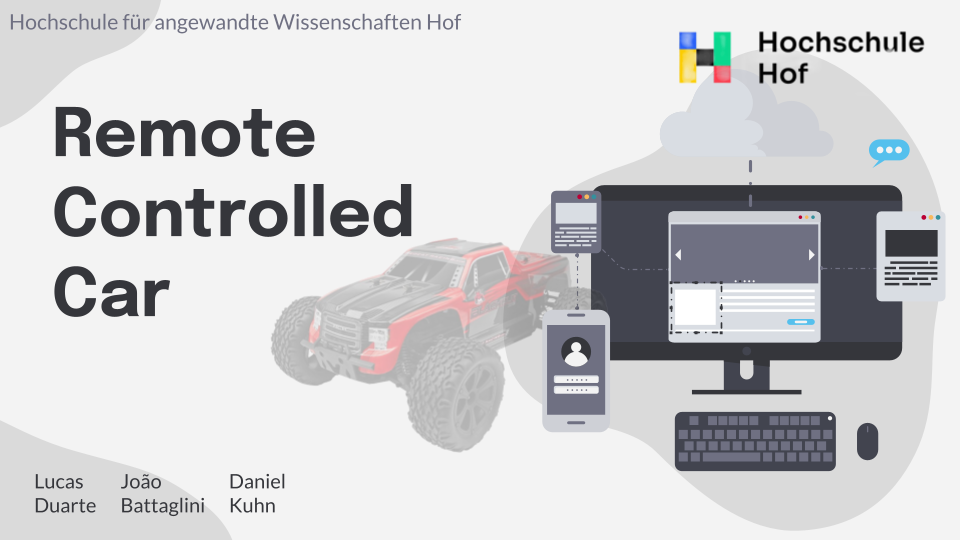

#  ROS Steering Car Simulation 
> 🇩🇪 Developed in Germany  🇩🇪
>

>  This project presents a simulated vehicle in the ROS (Robot Operating System) and Gazebo environment. The primary goal is to explore different methods of robot teleoperation and basic perception. The car is modeled with a steering mechanism and can be controlled via a standard keyboard or through real-time hand gestures captured by a webcam.

Additionally, the project includes a computer vision node for object detection and distance estimation, using a camera sensor and the YOLOv8 model.

---

[](https://docs.google.com/presentation/d/1IHDHYxDd89AFd3SCArOyJhQk58Bnfq_PZfDISJFwkpo/embed)
### click
[](https://docs.google.com/presentation/d/1IHDHYxDd89AFd3SCArOyJhQk58Bnfq_PZfDISJFwkpo/embed)
---
## 1. Key Features

- **Gazebo Simulation:** A realistic car model simulated in a custom Gazebo world.  
- **ROS Control:** Utilizes `ros_control` for managing joint controllers (effort-based).  
- **Multiple Control Modes:**
  1. **Keyboard Teleoperation:** Drive the car using the arrow keys, with adjustable power and proportional braking.
  2. **Hand Gesture Control:** Control acceleration, reversing, and steering by positioning your hand in the webcam's view, powered by MediaPipe.
- **Vision-Based Perception:**
  - A dedicated ROS node performs real-time vehicle detection (cars, buses, trucks) using YOLOv8.
  - Estimates the distance to the closest detected vehicle to simulate a basic collision avoidance warning system.

---

## 2. System Architecture

The project is composed of several nodes that communicate via ROS topics.

- **Simulation & Control**
  - `/gazebo`: Runs the main physics simulation.
  - `/car/controller_spawner`: Loads the joint controllers (wheels and steering) defined in `config/controllers.yaml`.
  - `/robot_state_publisher`: Publishes the robot's TF tree based on joint states.

- **Control Nodes (Choose one at a time)**
  - `steer_controller.py`: Reads keyboard input and publishes effort commands to the `/car` controllers.
  - `car_vision_control.py`: Captures webcam video, interprets hand gestures, and publishes effort commands.

- **Perception Node**
  - `collision_detection.py`: Subscribes to the car's camera feed, performs object detection, and visualizes the results.

---

## 3. Prerequisites

- **Ubuntu 20.04**  
- **ROS Noetic Ninjemys** (desktop-full installation recommended)  
- **Catkin** build tools  
- **Python 3.8+** with `pip`  
- **Python Libraries:**

    ```bash
    pip install opencv-python mediapipe ultralytics pynput rospy
    ```

---

## 4. Installation & Setup

This repository contains a complete Catkin workspace.

### Clone the Repository

```bash
cd ~
git clone https://github.com/LucasDuarte026/IntelligentRobotics
```


### Set Script Permissions:
Make all Python scripts executable. This is a crucial step to ensure rosrun can execute them.
```bash
cd ~/IntelligentRobotics/
chmod +x src/steering_car/scripts/*.py
```

### Build the Workspace

```bash
cd ~/IntelligentRobotics/
catkin_make
```

### Install Python Dependencies
Due to the nature of the ML libraries, the installation might take a while to complete.

```bash
pip install opencv-python mediapipe ultralytics pynput
```

### Source the Workspace

```bash
source ~/IntelligentRobotics/devel/setup.bash
```

> Tip: Add this command to your `~/.bashrc` file to avoid repeating it in every new terminal:

```bash
echo "source ~/IntelligentRobotics/devel/setup.bash" >> ~/.bashrc
```

---

## 5. Usage

Each of the following commands should be run in a **separate terminal**.  
**Don't forget to source your workspace** in each one:

```bash
source ~/IntelligentRobotics/devel/setup.bash
```

---

### A. Launch the Main Simulation

```bash
roslaunch steering_car gazebo.launch
```

---

### B. Run a Control Node (Choose One)

#### **Option A: Keyboard Control**

Run the keyboard controller node.  
> The terminal where this command is run **must remain in focus** to capture keystrokes.

```bash
rosrun steering_car steer_control.py
```

**Controls:**

- `↑`: Move forward  
- `↓`: Move backward  
- `← / →`: Steer left / right  
- `p`: Apply proportional brake  
- `+ / -`: Increase / decrease power  

---

#### **Option B: Hand Gesture Control**

Run the vision-based controller.  
> A window will pop up showing your webcam feed and a control grid overlay.

```bash
rosrun steering_car car_vision_control.py
```

**Controls:**

- **Top half** of screen: Move Forward  
- **Bottom half**: Reverse  
- **Left / Center / Right columns**: Steer Left / Straight / Right  

---

### C. (Optional) Run the Distance Estimator

This node can be run **alongside** the simulation and a control node.  
It will open a window showing the car's camera view with bounding boxes and distance estimates for detected vehicles.

```bash
rosrun steering_car collision_detection.py
```

---

## 6.. Project Structure

```
steering_car/
├── config/             # Controller configurations (PID gains)
├── launch/             # ROS launch files
├── scripts/            # Python control and perception nodes
├── urdf/               # Robot URDF and XACRO files
├── worlds/             # Custom Gazebo world files
├── CMakeLists.txt      # Build configuration
└── package.xml         # Package manifest and dependencies
```

---

## 7. Contributors


- [Lucas Duarte](https://github.com/LucasDuarte026) 
- [João Marcelo Ferreira Battaglini](https://github.com/JoaoMFB)   
- [Daniel Umeda Kuhn](https://github.com/DanielUmedaKuhn)

---

> Contributions are welcome! Feel free to fork the project and submit a pull request.
